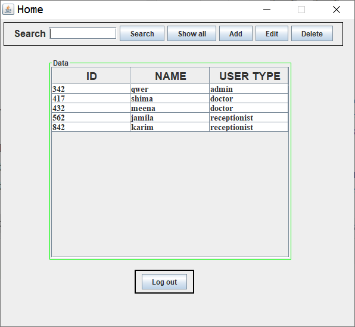
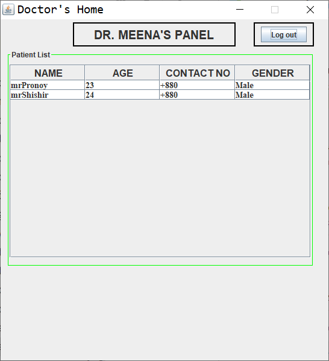
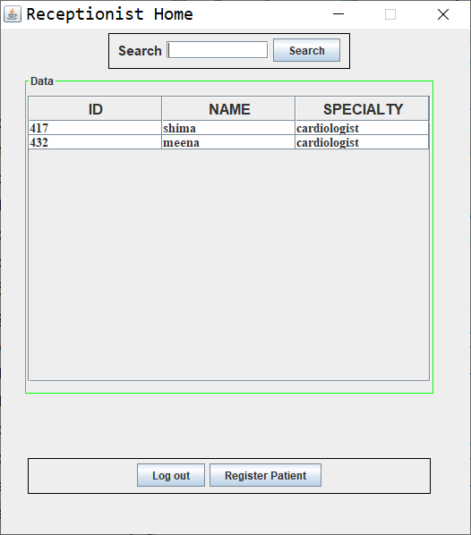
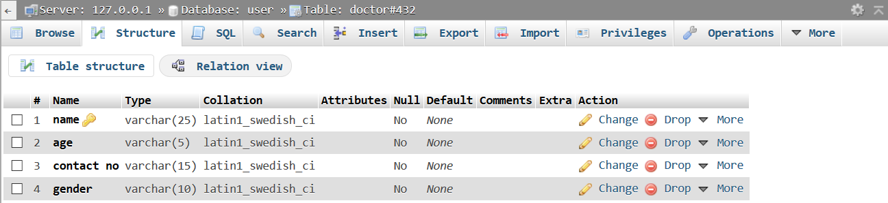
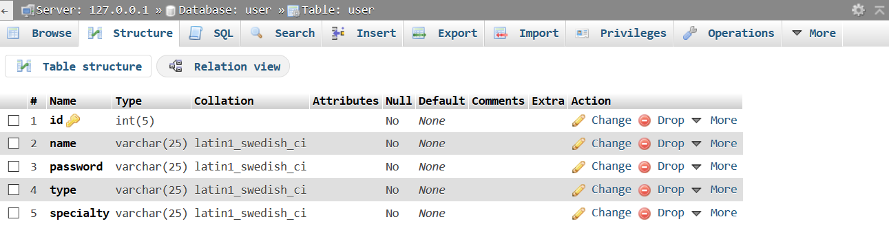

# Introduction
In this era of technological advancement, we are surrounded by the blessings of technology. It is making our life and activities more convenient and handy. And this convenience should reflect in every aspect of life. Being in a developing country, there still have a lot of scopes to make the best use of this blessing and make the society a little better. Hence, this project is an initiative towards that welfare. Though it is a partial management system it can be expanded or integrated into a larger project. It is hectic to keep the managerial works up to date for a clinic. The people who are responsible to provide a quality treatment should not go through any hassle about the managerial work, this project is there to help them. This project provides convenient yet basic managerial operations for a clinic. 

# User Category
There are three types of Users here.
-	Admin
-	Receiptionist
-	Doctor

# Feature List
**Admin**
-	An Admin can view all other users (i.e: Receiptionist, Doctor) and search them by  their name and type
-	Can “add” a new employee (a “Doctor” or a “Receiptionist”)  
-	Can edit details of any employee
-	Can delete an employee
-	Hence, an Admin can do all the “CRUD” operations

**Receiptionist**
-	Search a “Doctor” by their name or by specialty
-	Register a patient and insert that into a particular “Doctor’s” personal database

**Doctor**
- Can view his registered patient’s list

# GUI Description

**Components Used**
- **JFrame:** The whole window “Home” is the frame made for “Admin” user. 

- **JPanel:** Three panels are used: panel for top bar, middle table, bottom elements. Top bar for searching purpose, CRUD operations; middle table for employee data; bottom elements for a single log out button.

- **JTextField:** To search an employee by their name and user type.

- **JButton:** Six buttons are used: search, show all, Add, Edit, Delete, Log out. Search button to provide the searched result, show all button to show all of the employee in the database, Add button to add an employee providing a new frame, Edit button to edit an existing employee details providing a new frame, delete button to remove an employee, finally Log out button to go back the Login frame.

- **JTable:** Table used for showing employee details.

**Components Used**

- **JFrame:** The whole window “Doctor’s Home” is the frame made for user type “Doctor”. 

- **JPanel:** Three panels are used: panel for top panel, middle table, top right panel. Top bar to indicate a particular doctor’s panel; middle table for patient data; top right panel for a single log out button.

- **JButton:** Log out button to go back the Login frame.

- **JTable:** Table used for showing patient details.

- **JFrame:** The whole window “Receiptionist Home” is the frame made for user type “Receiptionist”. 

- **JPanel:** Three panels are used: panel for top panel, middle table, bottom element panel. Top bar to search a doctor by their name or specialty; middle table for doctor data; bottom element panel for a log out button and a resgister patient button to register a new patient.

- **JButton:** Log out button to go back the Login frame; Register Patient to provide a new frame where Receiptionist will register a new patient for a particular doctor’s panel. 

- **JTable:** Table used for showing doctor details.

# Database Table Description

# Tools Used
To develop this project we have used the following:
-	IntelliJ IDEA 
-	Xampp

# OOP and Java Concepts Used
-	**Association:** Creating another class’s object in current class.
-	**Swing Components:** Used many JComponents such as: JTextField, JButton, JTable etc.
-	**Swing Containers:** Used JContainers such as JFrame, JPanel etc.

# Impact of this Project
This project will allow a clinic to operate more efficiently and productively. As many repetitive parts are handled by the management software with ease. As a result less human labor are required and automated through the software which allows us to save time, cost for physical labor.

# Limitations and Possible Future Improvements
As this is a partial clinic management system, so many functionalities of a clinic were not included into the software. So a clinic cannot depend on this particular program. 
	
Many features of the software was developed until a particular phase, implementation of more complex Java concepts can easily allow us to take it to the next level and make it perfect and flawless.

